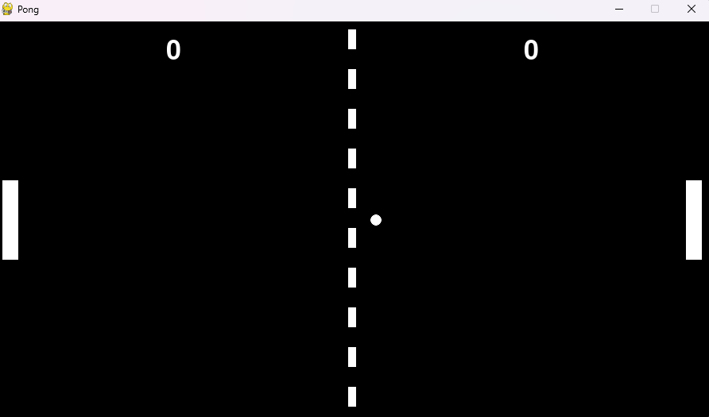
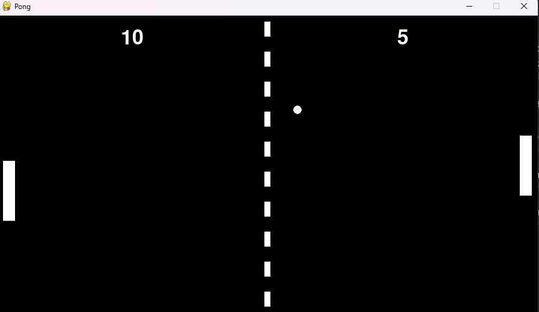

# Pong
Pong using pygame

# Required installation
```python
pip install pygame
```
## Running the Program
```python
py main.py
```

## Description 
Play the Pong game with two players.
- Player 1: move up and down using "w" and "s" key respectively
- Player 2: move up and down using the up and down arrow key




